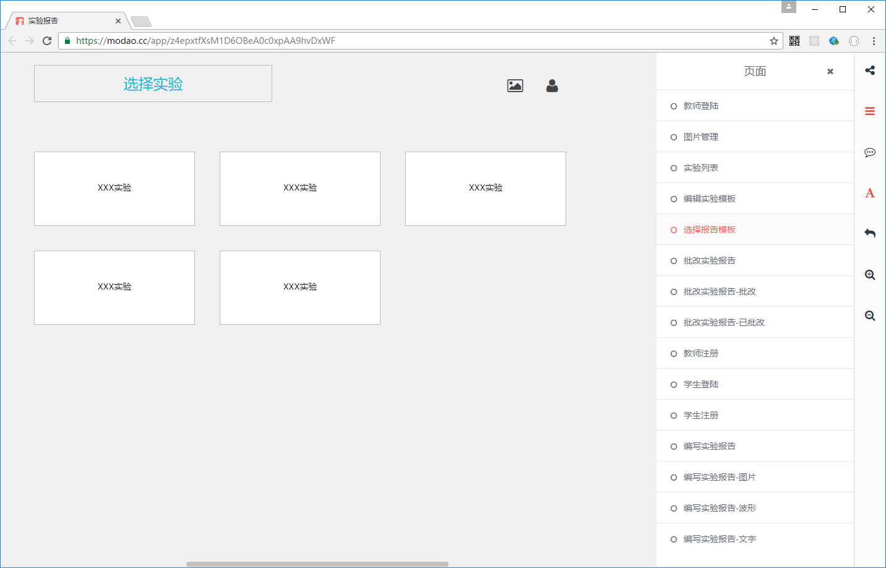
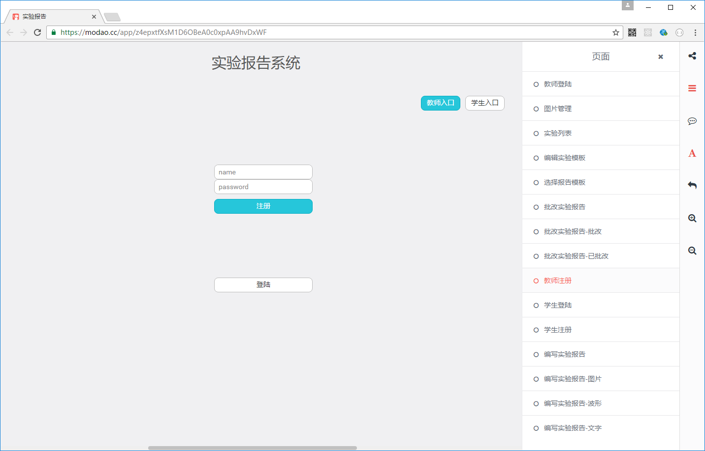
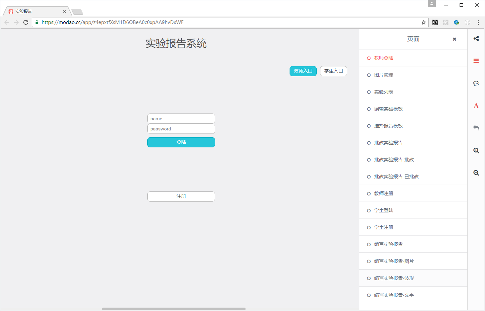
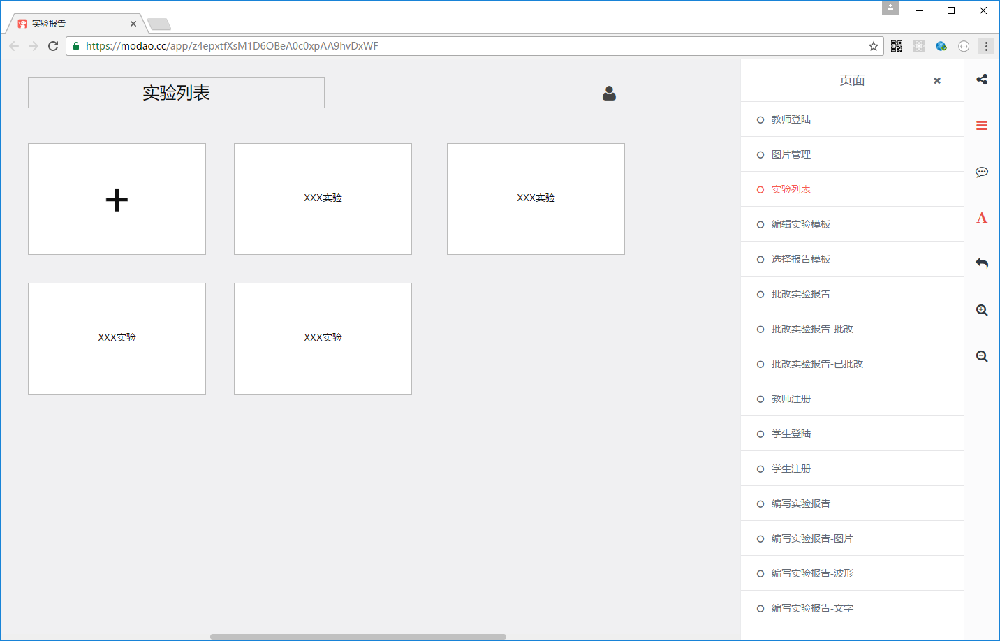
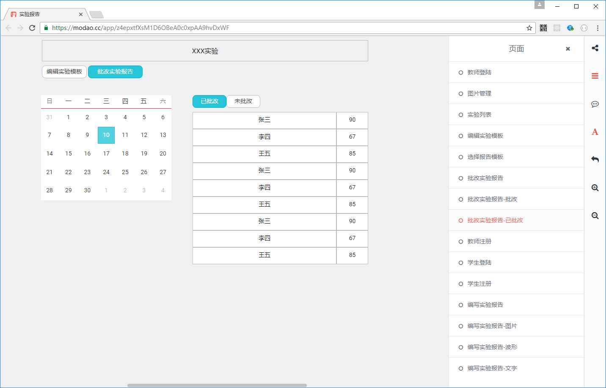

# 原型分析

[https://modao.cc/app/z4epxtfXsM1D6OBeA0c0xpAA9hvDxWF](https://modao.cc/app/z4epxtfXsM1D6OBeA0c0xpAA9hvDxWF)

### 全局

#### toast组件

```
用 https://github.com/CodeSeven/toastr 显示toast

接受消息,显示其中的msg
<-：{error,msg}
```
------------------
#### 学生注册


```
注册组件，输入姓名和密码，点击注册完成注册。如果失败给出提示。成功后进入学生注册页
提示通过全局消息给出。使用到的服务:login

路由：
student_reg

服务： 
s:student_reg(name,password)  

发出消息：
->:{error,msg}//失败
->:{route,"student_login"}//成功

```
------------------


```
路由：
student_login

服务： 
s:student_login(name,password)  

发出消息：
->:{error,msg}//失败
->:{route,"student_main"}//成功,进入学生主页：实验列表页
```
---------------------


```
路由：
student_report_list

组件:
登出按钮
	s:logout //登出
	->:{route,"student_login"} //登出后跳转到登陆页

实验列表
	s:getReportTemplates //取得实验模板列表
	->:{route,"student_edit/:templateID"} //编写实验报告
```
--------------------

```
路由
student_edit/:_id

服务：
取得实验报告
s:getCurrtentUser
s:getReportByTemplate(templateID) //根据实验报告模板取得实验报告，如果没有则新建一个
s:renderBlock(block) //显示内容块（内容块的编辑由内容块本身负责）

->:{route,"student_report_list"} //返回实验报告列表
```
---------------------

```
路由：
teacher_reg

服务： 
s:verify_teacher(code) //验证老师的超级密码，验证后方显示界面
s:teacher_reg(name,password)  

发出消息：
->:{error,msg}//失败
->:{route,"teacher_login"}//成功

```
-------------------

```
路由：
teacher_login

服务： 
s:teacher_reg(name,password)  

发出消息：
->:{error,msg}//失败
->:{route,"teacher_main"}//成功,进入教师主页:实验列表

```
-------------------

```
路由：
teacher_report_list


组件:

登出按钮：
	s:teacher_logout
	->:{route,"teacher_login"} //登出后跳转到登陆页
实验列表：
	服务:
	s:getReportTemplates //取得实验模板列表
	s:createReportTemplate //创建实验模板
	->:{route,"teacher_report/:id"} //跳转到“编辑实验模板”
```
---------------------

```
路由:
teacher_report_edit/id

组件：
编辑实验模板
	s:renderBlock //显示block，包括edit,show模式
	s:removeBlock //删除block
	s:getTemplateByID //取得template
```
------------------------

------------------------

```
路由:
teacher_report_judged
批改实验报告
	s:getReportDates //取得有实验报告的日期
	s:getReportByDate //取得某天的实验报告	
```

-------------------

```
路由:
teacher_report_judge
s:updateBlock
```

-------------------

```
s:getImages(student)
```
------------------

-------------


-----------------

```
s:uploadImage
s:removeImage
s:addTagToImage
```