# 原型分析

[https://modao.cc/app/z4epxtfXsM1D6OBeA0c0xpAA9hvDxWF](https://modao.cc/app/z4epxtfXsM1D6OBeA0c0xpAA9hvDxWF)

### 全局

#### toast组件
用 https://github.com/CodeSeven/toastr 显示toast

接受消息,显示其中的msg
<-：{error,msg}

#### 学生注册
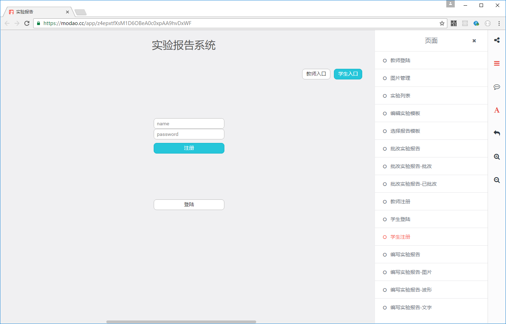
注册组件，输入姓名和密码，点击注册完成注册。如果失败给出提示。成功后进入学生注册页
提示通过全局消息给出。使用到的服务:login

服务： 
s:login(name,password)  

发出消息：
->:{error,msg}//失败
->:{route,"student_login"}//成功

路由：
student_reg

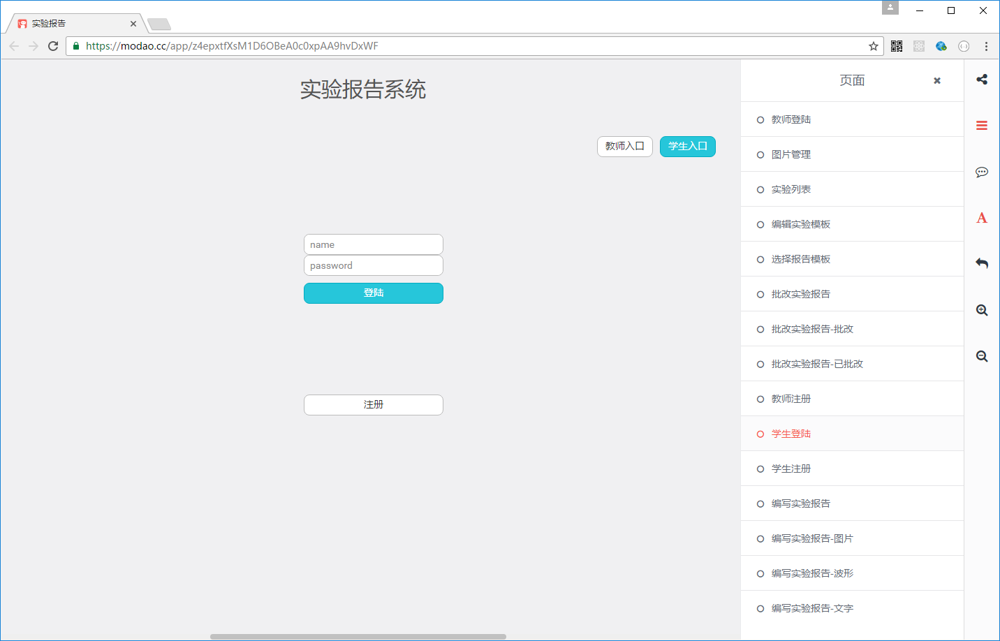
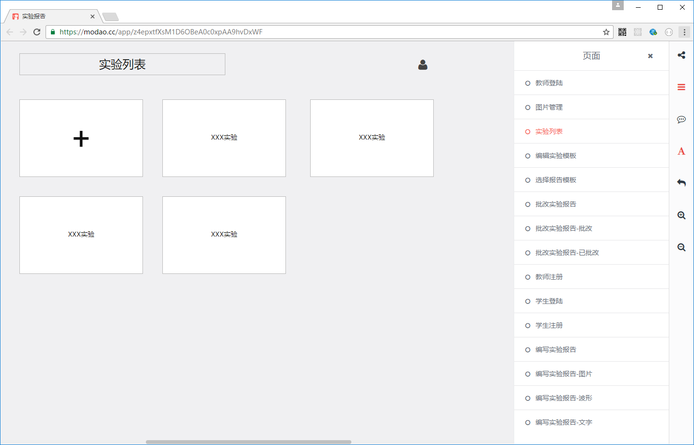
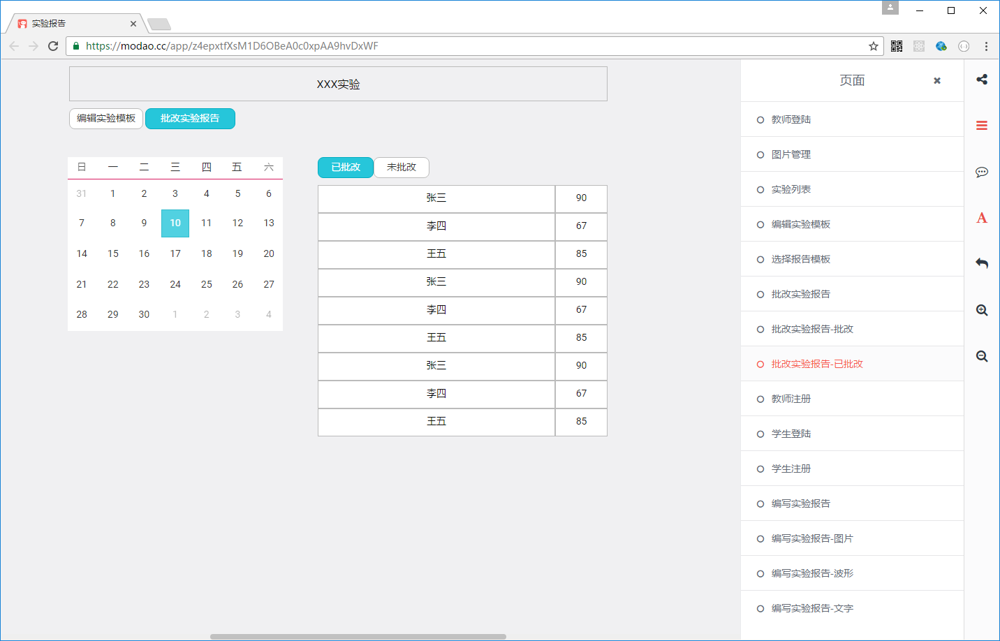
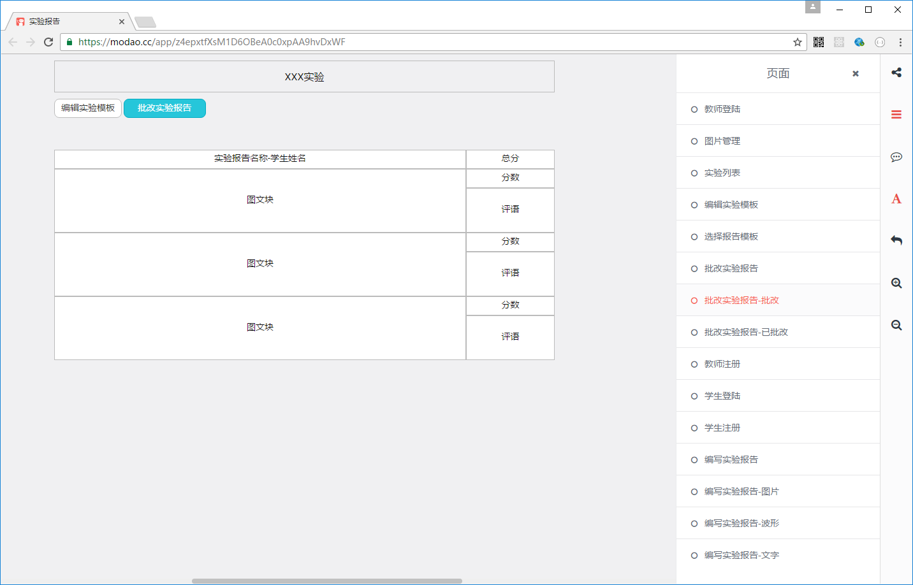
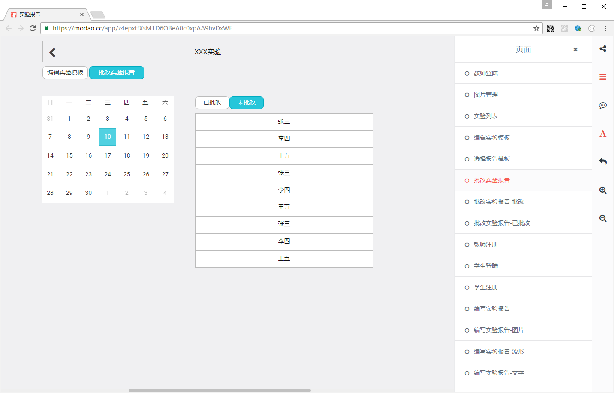
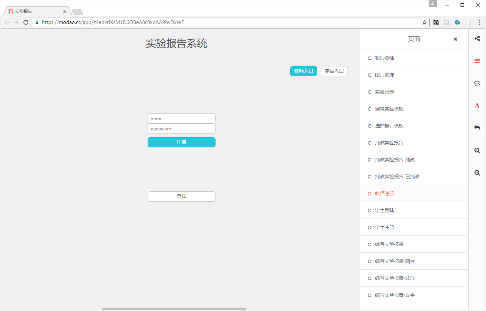
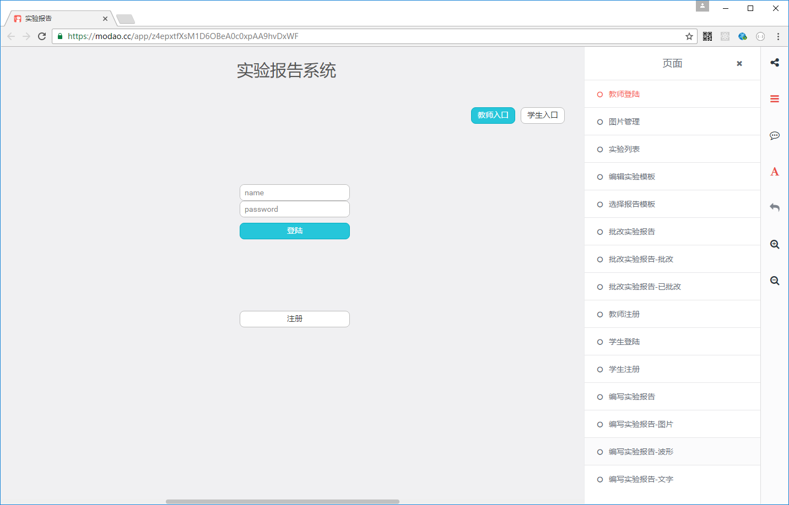
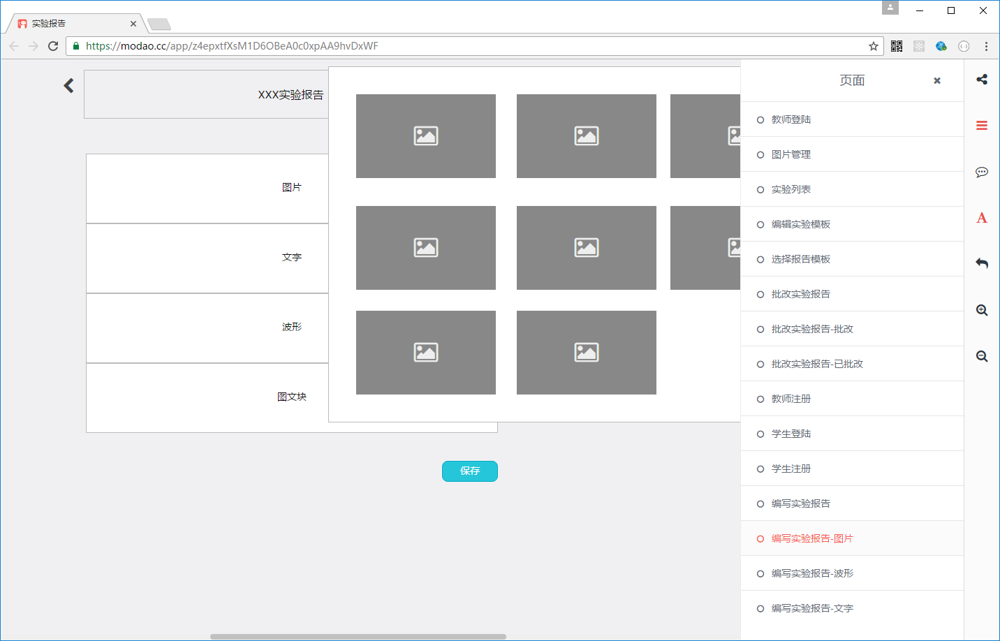

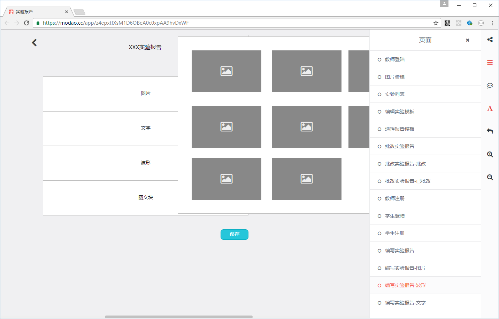
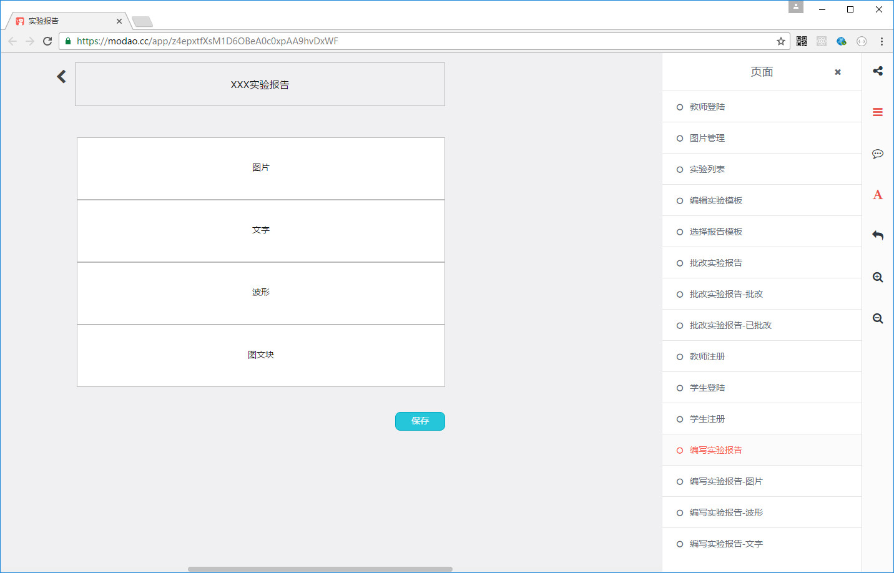
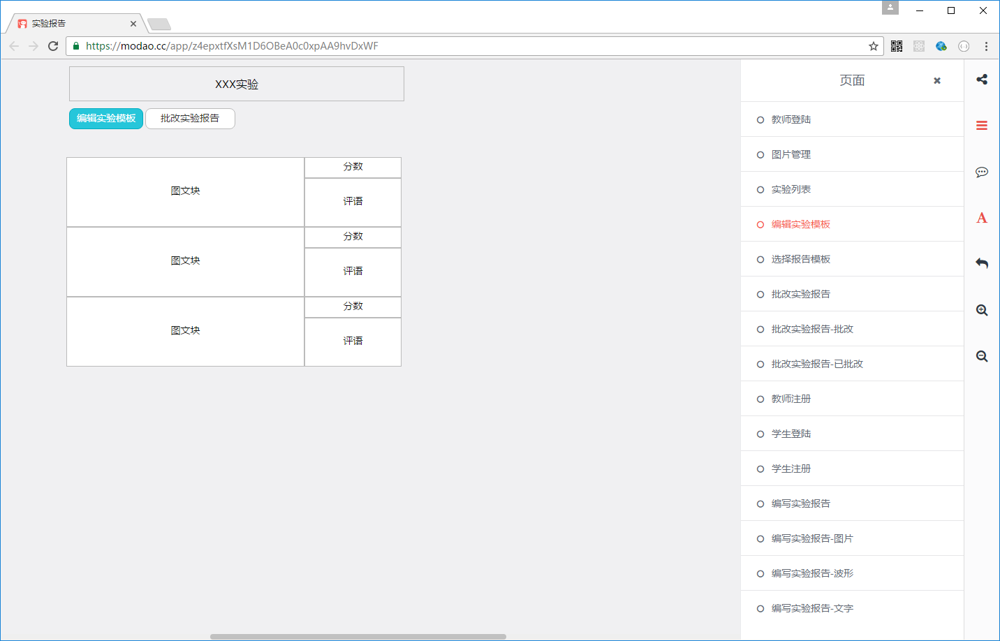
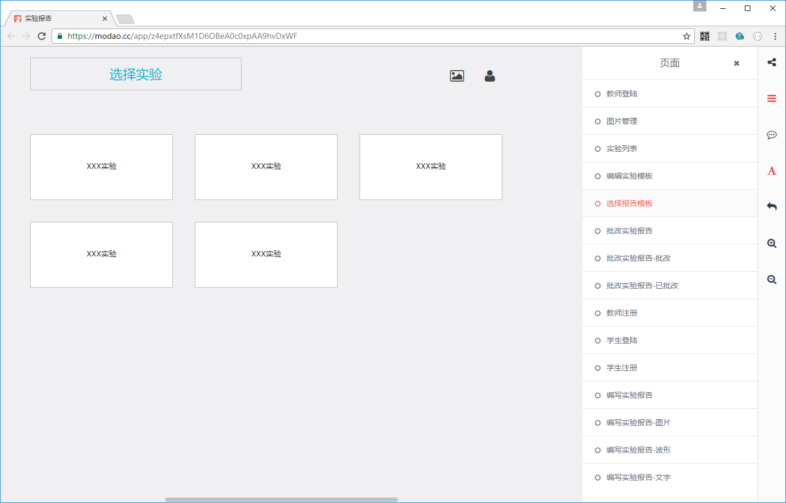
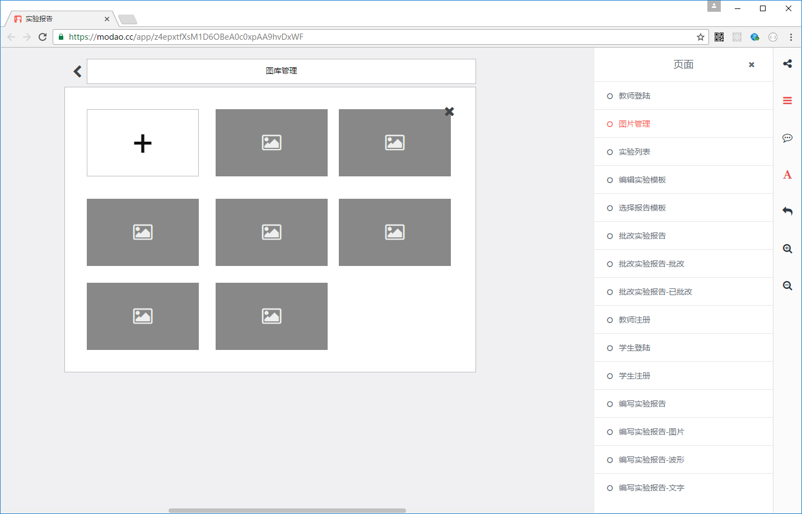
